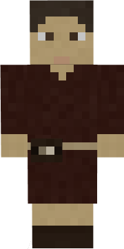
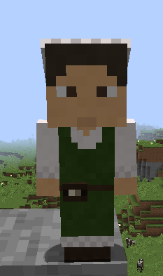

# Pupil

&nbsp;&nbsp;&nbsp;

  

    

      
<strong>Primary Trait:</strong>

      
<strong>Secondary Trait:</strong>

      
<strong>Building:</strong>

    

    

      
Intelligence & Knowledge

      
Mana

      
<a href="../buildings/school">School</a>

    

  

Welcome to the Pupil’s Information Site.

The Pupil is a child of the colony, while they are not technically the worker of the school, the school is where you would hire them to participate in the School. The [Teacher](../workers/teacher) will teach the Pupils (children) of the colony. While they can learn with no supplies, providing paper will increase the speed that the Pupils level. 

Click here for full information about the [School's hut](../buildings/school) block and using your [Building Tool](../items/buildingtool). Once the hut is placed, the Teacher will be automatically assigned (or you can manually assign one with the best [Traits](../systems/workerinfo) for a Teacher if you changed this in the setting tab in the [Town Hall's GUI](../../source/buildings/townhall).

You now officially have Pupil's, **CONGRATULATIONS!**
