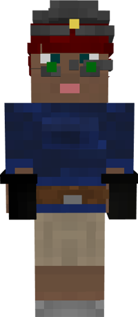

# Quarrier

&nbsp;&nbsp;&nbsp;

  

    

      
<strong>Primary Trait:</strong>

      
<strong>Secondary Trait:</strong>

      
<strong>Building:</strong>

    

    

      
Strength

      
Stamina

      
<a href="../buildings/quarry">Quarry</a>

    

  

The Quarrier is part of the resource production of your colony. The Quarrier will dig a quarry pit to collect larger amounts of stone type blocks.

The Quarrier will only break blocks according to the level of their pickaxe, and will only be able to use a tool according to the level of their miner's hut (check the [worker](../systems/worker) system page).

The Quarrier has a chance to get lucky in finding ores when digging out cobblestone or stone! This is the default setting in the [configuration file](../../source/misc/configfile), but you can change this.

The Quarrier's Strength level affects their block breaking speed. Similarly, their Stamina skill affects their block placing speed, so if they have a higher Stamina skill they'll place supports and other blocks faster. 
