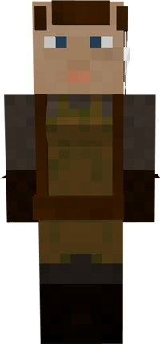

# Rabbit Herder

&nbsp;&nbsp;&nbsp;

  

    

      
<strong>Primary Trait:</strong>

      
<strong>Secondary Trait:</strong>

      
<strong>Building:</strong>

    

    

      
Agility

      
Athletics

      
<a href="../buildings/rabbithutch">Rabbit Hutch</a>

    

  

The Rabbit Herder is a part of your colony's food production needs. The Rabbit Herder will breed and butcher rabbits for you as long as you provide them with carrots and an axe.

**Note:** The Rabbit Herder will not catch and bring in any rabbits, only breed and butcher the ones in their hut area, so make sure you provide them with at least 2 initial rabbits.

The Rabbit Herder will work with vanilla Minecraft rabbits, but might work with some rabbits from other mods as long as they are *coded* as rabbits and have normal breeding behavior. They will collect anything that is modified by another mod as well, so if another mod changes the drops (for example) to include bones or another type of meat, the Rabbit Herder will collect these as well.

**Note:** The Rabbit Herder will only keep alive 2 rabbits per hut level, so when their hut is level 5 they will have 10 rabbits in their holding pens to breed and butcher. This means they will produce meat and other drops faster.

| Hut Level | Rabbits Housed |
| --------- | ----------- |
| 1         | 2           |
| 2         | 4           |
| 3         | 6           |
| 4         | 8           |
| 5         | 10          |

The greater a Rabbit Herder's Agility level, the higher their chance to successfully hit a rabbit (if they miss, they'll keep trying until the rabbit dies). The greater their Athletics level, the slower it'll take for rabbits to grow up.
