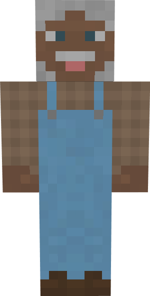

# Shepherd

&nbsp;&nbsp;&nbsp;

  

    

      
<strong>Primary Trait:</strong>

      
<strong>Secondary Trait:</strong>

      
<strong>Building:</strong>

    

    

      
Focus

      
Strength

      
<a href="../buildings/shepherd">Shepherd's Hut</a>

    

  

The Shepherd is a crucial part of your colony's food production needs. They will also provide you with all drops and byproducts like wool. The Shepherd will breed and butcher sheep for you as long as you provide them with wheat and an axe. 

**NOTE:** The Shepherd will not catch and bring in any sheep, only breed and butcher the ones in their hut area, so make sure you provide them with at least 2 initial sheep.

The Shepherd will work with vanilla Minecraft sheep, but might work with some sheep from other mods as long as they are *coded* as sheep and have normal breeding behavior. They will collect anything that is modified by another mod as well, so if another mod changes the drops (for example) to include bones or another type of meat, the Shepherd will collect these as well.

On page two of the Shepherd Hut's GUI, you can choose if the Shepherd will randomly dye their sheeps' wool different colors. This doesn't use up dye.

**Note:** The Shepherd will only keep alive 2 sheep per hut level, so when their hut is level 5 they will have 10 sheep in their holding pens to breed and butcher. This means they will produce meats and byproducts faster.

| Hut Level | Sheep Housed |
| --------- | ------------ |
| 1         | 2            |
| 2         | 4            |
| 3         | 6            |
| 4         | 8            |
| 5         | 10           |

The higher a Shepherd's Focus level, the more wool they'll collect. The higher their Strength level is, the more damage they'll do per attack.
