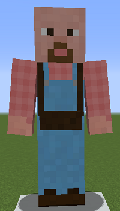
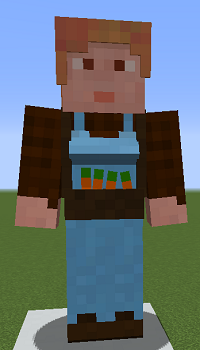

# Swineherd

&nbsp;&nbsp;&nbsp;

  

    

      
<strong>Primary Trait:</strong>

      
<strong>Secondary Trait:</strong>

      
<strong>Building:</strong>

    

    

      
Strength

      
Athletics

      
<a href="../buildings/swineherd">Swineherd's Hut</a>

    

  

The Swineherd is a crucial part of your colony's food production needs. The Swineherd will breed and butcher pigs for you as long as you provide them with carrots and an axe.

**NOTE:** The Swineherd will not catch and bring in any pigs, only breed and butcher the ones in their hut area, so make sure you provide them with at least 2 initial pigs.

The Swineherd will work with vanilla Minecraft pigs, but might work with some pigs from other mods as long as they are *coded* as pigs and have normal breeding behavior. They will collect anything that is modified by another mod as well, so if another mod changes the drops (for example) to include bones or another type of meat, the Swineherd will collect these as well.

**Note:** The Swineherd will only keep alive 2 pigs per hut level, so when their hut is level 5 they will have 10 pigs in their holding pens to breed and butcher. This means they will produce meat faster.

| Hut Level | Pigs Housed |
| --------- | ----------- |
| 1         | 2           |
| 2         | 4           |
| 3         | 6           |
| 4         | 8           |
| 5         | 10          |

The higher a Swineherd's Strength level, the more damage they'll do per attack. Pigs will grow up faster when the Swineherd has a higher Athletics level.
