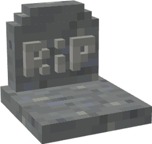
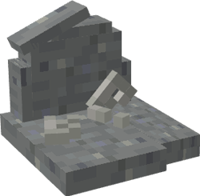

# Undertaker

&nbsp;&nbsp;&nbsp;

  

    

      
<strong>Primary Trait:</strong>

      
<strong>Secondary Trait:</strong>

      
<strong>Building:</strong>

    

    

      
Strength

      
Mana

      
<a href="../buildings/graveyard">Graveyard</a>

    

  

The Undertaker deals with deceased citizens. When a citizen dies, a grave will spawn at the location of death.

After a short time, graves will decay and eventually disappear. There are [researches](../../source/systems/research) to increase this time.

The grave (decayed or not) will hold all the items the citizen had in their inventory at the time of death. The player can right-click the grave to open its inventory and retrieve the items. The Undertaker will walk (run if you've completed the relevant research) toward the grave and retrieve its inventory, then go back to the Graveyard.

Once the Undertaker gets to the Graveyard, they will attempt to revive the deceased citizen. The chance for them to succeed can be increased by researches, the Undertaker's Mana skill, and the level of the Graveyard. The chance is capped at about 10%.

If the citizen cannot be revived, the Undertaker will bury them in the Graveyard. Another grave will be placed with the citizen's name on it (this grave does not store items). If a citizen is buried, the mourning time for them is a half day instead of the normal full day.

If no citizens have died recently, the Undertaker will visit the [Mystical Site](../../source/buildings/mysticalsite). Doing so will increase their Mana level. They will also visit other citizens to get to know them.

The Undertaker is exempt from mourning so they can complete their job.

The higher an Undertaker's Strength skill, the faster they can dig graves.
