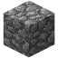

# Recipes



  

    

      

         
      

      

         
      

      

         
      

    

    

      

        {{ icons.boat }}
      

      

           
      

      

        {{ icons.boat }}
      

    

    

      

        {{ icons.boat }}
      

      

        {{ icons.boat }}
      

      

        {{ icons.boat }}
      

    

  

  

     
  

  

    

      

    

  

    

        

            

               
            

            

               
            

            

              

            

        

        

            

               
            

            

              

            

            

               
            

        

        

            

              

            

            

               
            

            

               
            

        

    

    

    

        

            

            

        

    


